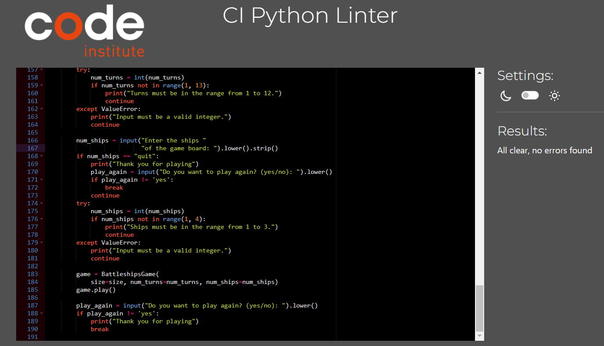

# Welcome to my Battleships Game!

This is a Code Institute portfolio project 3 based on python.

## About

The game of Battleships is well known. My game is a simple version of this game. You can use the link under this to go to the game. Please enjoy!

[A link to the project](https://milestone-project-3-landfish-68935be59d7a.herokuapp.com/)

## How to play

The has the rules explained when you start it up.

You choose the board size and the number of turns between 1 - 12 for you and the computer.

You will also choose number of ships between 1 - 3.

You then play the game as you would normally play a game of battleships.

This is by choosing a column and a row.

You and the computer have a board each.

You will see the choices the computer makes as well as the choices you have made.

If you either run out of turns or the computer or you hit a ship(s) , the game ends.

You can quit at any time by typing the word 'quit'.

## Flowchart

This is a basic flowchart of how the game works out.

## Testing

- The testing was done at intervals during the build.
- I tested this game in the terminal using 'python3 run.py'.
- After the game was fully build and tested until it worked.
- I also tested it on [A link to the validator](https://pep8ci.herokuapp.com/) . 

- This is a site that tests if the code is fully readable and presentable.

## Bugs I encountered

- There was mainly one problem I ran into during my building of this game.
- It was the quitting aspect of the game.
- One of the builds the game gave an error message.
- I restructered the code and this has now been fixed.

## Deployment

This project was deployed using Code Institute's mock terminal for Heroku.

The steps for deployment are as follows:
- Fork or clone this repository
- Create a new Heroku app
- Set the buildpacks to Python and NodeJS in that order
- Link the Heroku app to the repository
- Click on Deploy

## Credits

- This project uses the [Code Institute student template](https://github.com/Code-Institute-Org/python-essentials-template) for deploying the third portfolio project, the Python command-line project.
- The idea of using battleships is a suggested one by the Code Institute with "Ultimate Battleships" as inspiration.
- I also took inspiration from the many Battleships walkthroughs from youtube or the web.
- Thank you to my mentor Spencer who helped me with the finished code.

-----
Thank you for viewing my project.